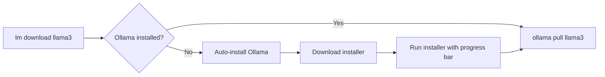

# Features & Architecture

## Hardware Detection

LocalMind uses `psutil` for cross-platform system information and `GPUtil` for NVIDIA GPU detection.

| Component | Library | Details |
|---|---|---|
| **CPU** | `psutil` | Name, physical/logical cores, max frequency |
| **RAM** | `psutil` | Total and available memory in GB |
| **GPU** | `GPUtil` | Name, VRAM in MB, driver version (NVIDIA only) |
| **Disk** | `psutil` | Total, used, and free space on root partition |
| **OS** | `platform` | System name and release version |

`GPUtil` is installed on Windows and Linux but excluded on macOS (where it provides no value). GPU detection is wrapped in a try/except — if no GPU is found, the report simply shows "None detected".

<!-- screenshot: lm hardware output -->

## Tier Classification

Once hardware is scanned, the classifier maps your specs to a performance tier. The thresholds are defined in `localmind/constants.py`:

| Tier | Min RAM | Min VRAM | Recommended Model Size |
|---|---|---|---|
| Enthusiast | 64 GB | 16 GB | 32B–70B+ |
| High-End | 32 GB | 8 GB | 14B–32B |
| Midrange | 16 GB | 4 GB | 7B–14B |
| Entry | 8 GB | 2 GB | 4B–8B |
| Tiny | — | — | 1B–4B |

The classifier iterates from highest to lowest tier and picks the first one where your hardware meets both RAM and VRAM thresholds. If both are met for multiple tiers, the higher tier wins.

```python
# Simplified classification logic
for tier, req in sorted(thresholds, key=descending_ram):
    if ram >= req["min_ram"] and vram >= req.get("min_vram", 0):
        return tier
```

## Recommendation Engine

### General Recommendations

The general recommendation (`lm recommend`) returns the tier's parameter size range — e.g., "7B-14B" for a Midrange machine. This tells you what size models to target without prescribing a specific model.

### Task-Specific Recommendations

For `coding`, `writing`, and `reasoning`, LocalMind maintains curated model lists per tier in `constants.py`:

```python
TASK_RECOMMENDATIONS = {
    "coding": {
        "Tiny":       ["tinyllama:latest", "stablelm-zephyr:3b"],
        "Entry":      ["codellama:7b", "deepseek-coder:6.7b"],
        "Midrange":   ["codellama:13b", "deepseek-coder:6.7b"],
        "High-End":   ["deepseek-coder:33b", "codellama:34b"],
        "Enthusiast": ["deepseek-coder:33b", "codellama:34b"],
    },
    # writing and reasoning follow the same pattern
}
```

These lists are currently **static** — curated based on community knowledge and model benchmarks. A future version may incorporate live benchmark data.

## Ollama Integration

### Search

The `search` command queries the [public Ollama API](https://ollama.com/api/library) (`api/library` endpoint) with your keyword and sorts results by popularity (pulls). This means you always see the most relevant models first.

### Inspect

`lm info` runs `ollama show <model>` locally and parses the JSON output. This requires Ollama installed and the model already pulled.

### Download

`lm download` calls `ollama pull <model>` and streams the download progress to your terminal in real time. Before pulling, it checks if Ollama is available:



### Automatic Installation

If Ollama is missing, LocalMind downloads and runs the official installer:

- **Windows**: `irm https://ollama.com/install.ps1 | iex`
- **macOS / Linux**: `curl -fsSL https://ollama.com/install.sh | sh`

A Rich progress bar shows download progress during installation.

## Architecture Overview

```
localmind/
├── cli.py               # Typer CLI — all commands
├── hardware.py           # psutil + GPUtil wrappers
├── classifier.py         # RAM/VRAM → tier mapping
├── recommendations.py    # General + task-specific logic
├── doctor.py             # Aggregates everything into a report
├── ollama_api.py         # Search API, local ollama calls, auto-install
├── models.py             # Pydantic models (HardwareReport, MachineClass, etc.)
├── constants.py          # Tier thresholds, model tables
└── utils.py              # Logging, warning generation
```

<!-- screenshot: architecture diagram -->

## Extensibility

You don't need to fork the project to customise it. All tier thresholds and model recommendations live in a single file:

**`localmind/constants.py`**

- Change `TIER_THRESHOLDS` to adjust classification rules.
- Change `TIER_PARAM_RANGES` to tweak recommended parameter sizes.
- Change `TASK_RECOMMENDATIONS` to add, remove, or reorder models.

```python
# Example: add a new tier
TIER_THRESHOLDS["Ultra"] = {"min_ram": 128, "min_vram": 32}
TIER_PARAM_RANGES["Ultra"] = "70B-120B"
```

No configuration files, no environment variables, no hidden magic.
